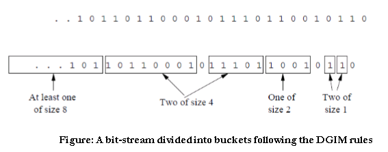

# DGIM
The goal is to obtain sum of last K integers from integer data stream. DGIM algorithm is used to maintain aggregates and statistics over data stream with respect to the last N data elements seen so far using the sliding window. We run two threads one thread
read an input stream of 16-bit unsigned integers from a socket with host:port pair,and another thread accepts queries from stdin and answers the sum of past k integers to stdout.

## Basic Approach 
Our approach toward solving the BasicCounting problem is to maintain a histogram that records the timestamp of selected
1’s that are active in that they belong to the last N elements.Each data element has an arrival time, which increments by
one at each arrival of new element.In addition, we maintain a timestamp, which corresponds to the position of an active data element in the current window.



## Inputs 
The input consists of two line, first line should include the R value or the maximum number of buckets allowed, the second line consists of the port number we want to connect to, followed by the queries about the sum taken in real time.

### Bucket Creation 
A bucket in the DGIM method is a record consisting of:
1. The timestamp of its end [O(log N ) bits]
2. The number of 1’s between its beginning and end [O(log log N ) bits]. 

Bucket creation is done using the code given below 
```java
public class UnitBuck {
    int buckSize;
    long startTimeStamp;

    UnitBuck(int buckSize,long startTimeStamp){
        this.buckSize = buckSize;
        this.startTimeStamp = startTimeStamp;
    }
}
```

### Rules maintained
While creating buckets, the following rules are taken care of - 
* The right end of a bucket is always a position with a 1.
* Every position with a 1 is in some bucket.
* No position is in more than one bucket.
* There are one or two buckets of any given size, up to some maximum size.
* All sizes must be a power of 2.
* Buckets cannot decrease in size as we move to the left (back in time).

### Updating buckets
1. When a new bit comes in, drop the last (oldest) bucket if its end-time is prior to N time units before the current time.
2. If the current bit is 0, no other changes are needed.
3. If the current bit is 1:
   - Create a new bucket of size 1, for just this bit -> End timestamp = current time.
   - If there are now three buckets of size 1, combine the oldest two into a bucket of size 2.
   - If there are now three buckets of size 2, combine the oldest two into a bucket of size 4. And so on…

# Querying 
To estimate the number of 1’s in the most recent N bits:
1. Sum the sizes of all buckets but the last.
2. Add in half the size of the last bucket. As we don’t know how many 1’s of the last bucket are still within the window.

# Evaluation
Solution gives approximate answer, never off by 50%, Error factor can	be reduced to	any	fraction > 0,	
with more complicated	algorithm	and	proportionally more stored bits.
Instead	of	maintaining	1	or 2 buckets of	each size, we allow	either r-1 or	r	buckets (r > 2)	
* Except	for	the	largest	size	buckets; we	can	have any number	between	1	and	r	of those	
* Error	is	at	most	O(1/r)
* By picking r appropriately,	we can tradeoff	between	number of	bits we	store	and	the error.

# Acknowledgement
http://people.cs.vt.edu/badityap/classes/cs5614-Fall14/lectures/lecture-14.pdf                                
Mining of Massive Datasets Jure Leskovec,Stanford Univ.,Anand Rajaraman,Milliway Labs,Jeffrey D. Ullman,Stanford Univ.
http://www.ques10.com/p/2870/explain-dgim-algorithm-for-counting-ones-in-a-wi-1/


